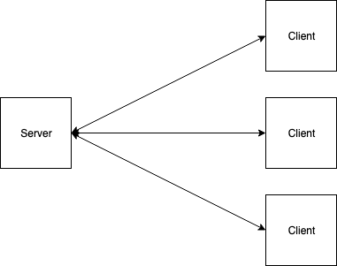

# Centralized PRNG

This is an example implementation of the centralized pseudo random number generator.

It uses Proto Buffer and gRPC to create a Publish-Subscribe model. Each client interested in receiveing a new random (round index, random) initiates the communication to the server by creating a gRPC bi-directional channel. 
For each new client connection, the server registers the connection into a new channel. If the client drops that connection, the server removes that subscription.
At every time interval, the server generates a new random and by looping through the list of active connections, sends the new random to each client.



## Dependencies

```
go get -u google.golang.org/grpc
go get -u github.com/golang/protobuf/proto
```

## Usage

- `-interval` (int) - The time interval of random number generation (seconds) (default 2)
- `-port` (int) - The server port (default 10000)